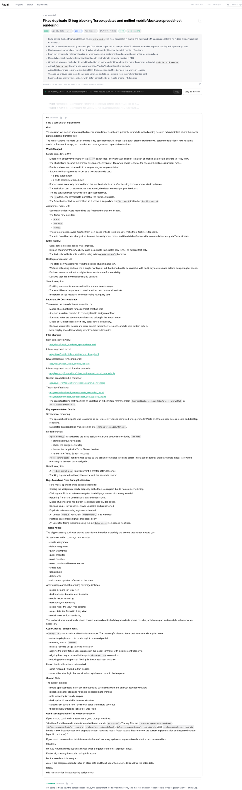
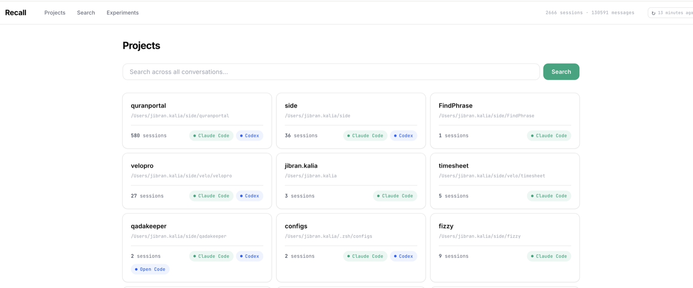

# Recall

Your AI conversations disappear into `~/.claude/` and `~/.codex/` as scattered JSONL files. Recall pulls them into one place, indexes everything with full-text search, and gives you a web UI and CLI to actually find things again.

## The problem

You've had hundreds of conversations with Claude Code and Codex. You *know* you solved that exact problem three weeks ago, but good luck finding it. The session files are opaque, spread across project directories, and unsearchable. And when you do find one, try copying a full conversation out of the terminal -- good luck with that too.

## What Recall does

**Imports** conversations from Claude Code and OpenAI Codex into a single SQLite database. **Indexes** every message with FTS5 full-text search. **Serves** a web UI for browsing and a CLI for quick lookups.

## Screenshots

A rendered session with auto-generated summary, token/cost metadata, and one-click Markdown export:



Projects index — conversations grouped by the repo/directory they happened in:



- **Markdown export** -- every session has a one-click Markdown copy button, so you can grab an entire conversation cleanly instead of fighting terminal selection
- **Search across everything** -- find that conversation where you debugged the OAuth flow, with highlighted snippets showing exactly where the match is
- **Browse by project** -- conversations grouped by the repo/directory they happened in
- **Auto-generated titles and summaries** -- sessions get titles via a local LLM (Ollama) so you're not staring at "Untitled session" everywhere
- **Experiments** -- compare prompts across LLM providers (Ollama, Claude, Codex, OpenCode) side-by-side with cost and speed tracking
- **Incremental imports** -- checksum-based dedup means you can re-run imports without duplicating anything
- **Works from anywhere** -- data lives in `~/.config/recall/`, so the CLI works regardless of your current directory

## Quick start

```bash
git clone <this-repo>
cd recall
bin/setup                     # Install deps, create DB
bin/rails recall:import       # Import your conversations
bin/dev                       # Start the web UI at localhost:3000
```

Or use the CLI:

```bash
bin/recall search "OAuth token refresh"
bin/recall projects
bin/recall stats
bin/recall update             # Pull latest code, bundle, migrate
```

## Configuration

Recall reads two config files at boot:

- `config/recall.rb` — checked in, has defaults and AI-facing instructions.
  Edit this for settings you want in version control.
- `config/recall.local.rb` — gitignored, for machine-specific overrides
  (personal paths, private model defaults, etc.).

Open `config/recall.rb` for the full list of knobs: import source paths,
project domain classification, Ollama host, default models, and more.
Every setting is optional; missing source paths are skipped silently at
import time.

Override the data directory with the `RECALL_DATA_DIR` env var (it has to
be an env var — `database.yml` reads it at boot before `config/recall.rb`
loads). Default: `~/.config/recall/`.

## Supported sources

| Source | Default location | What's imported |
|--------|------------------|-----------------|
| Claude Code | `~/.claude/projects/**/*.jsonl` | Messages, tool calls, token usage |
| OpenAI Codex | `~/.codex/sessions/**/*.jsonl` | Messages, metadata from state DB |
| OpenCode | `~/.local/share/opencode/opencode.db` | Sessions, messages, parts |

Add additional Claude Code directories (e.g. a work profile under a
different `CLAUDE_CONFIG_DIR`) via `config/recall.local.rb`.

## Built with

Rails 8.1, Ruby 3.4, SQLite3 + FTS5, Hotwire (Turbo + Stimulus), Solid Queue. No Postgres, no Redis, no external dependencies beyond a Ruby runtime.

## License

This is a personal tool shared as-is. No warranty, no support obligations.
